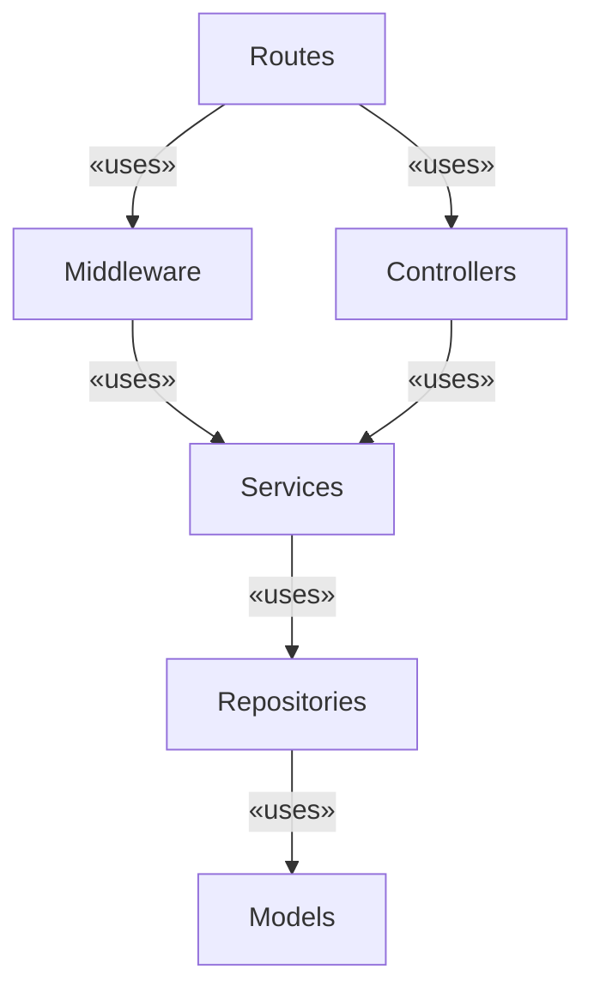

# Documentation

## Project structure

The project is structured into several layers, each responsible for a specific aspect of the application. The main layers are:

1. **Routes**: This layer is responsible for handling HTTP requests and responses. It defines the endpoints of the API and maps them to specific controller functions. The routes layer uses Express.js to create and manage routes.
2. **Middleware**: The middleware layer contains functions that process requests before they reach the controllers. Middleware functions can perform tasks such as authentication, logging, and request validation. They can be applied globally or to specific routes.
3. **Controllers**: The controllers layer contains the logic for processing incoming requests, interacting with services, and returning responses. Each controller corresponds to a specific resource or functionality in the application.
4. **Services**: The services layer contains the business logic of the application. Services interact with repositories to perform CRUD operations and implement the core functionality of the application.
5. **Repositories**: The repositories layer is responsible for data access and persistence. It abstracts the underlying database operations and provides a clean interface for the services to interact with the data store.
6. **Models**: The models layer defines the data structures and schemas used in the application. It includes definitions for entities such as users, products, and orders.

The following diagram illustrates the relationships between these layers:

In each of this layer, there is a file named `index.js` that provides an handy helper function responsible for creating instances of routers, middleware, controllers, services, repositories and models, and wiring them together to form a cohesive application, handling the dependency injection.

The project includes also several fearures that are orthogonal to the main layers, such as:

1. **Auth**: This feature handles user registration, login, and authentication using JWT tokens. It includes controllers, services, and middleware specific to authentication.
2. **Restaurant**: This feature manages restaurant-related functionality, including restaurant creation and modification.
3. **Review**: This feature allows users to create and manage reviews for restaurants.

### Why is the project structure layer-first?

The project structure follows a layer-first approach. This means that the src folder is organized by the application layers rather than by features. In practice, the main subfolders are named after the layers they represent (e.g., controllers, services, repositories), instead of grouping code by feature.

The reason behind this choice is the relatively small size of the project: using a feature-first structure would add unnecessary verbosity and fragmentation. With a layer-first structure, the codebase remains simpler, easier to navigate, and more maintainable at this scale.

## Data Handling

Like most web apps, this project has to deal with different representations of the same data. On the one hand, we want to keep certain information hidden from the user for security reasons (e.g., the user ID). On the other hand, data persistence details are often inconvenient to work with directly. For this reason, each piece of data has three representations:

- an external one, called **DTO** (Data Transfer Object), safe to share with the user;
- an internal one, called **Entity**, convenient to manage;
- and a persistent one, called **Schema**, containing the information needed to store data in the database.

The responsibility for converting data between its persistent and internal versions is entrusted to the repository layer.  
Conversions between the internal and external representations must be handled in both directions:

- on **input**, the data sent by the user in a request must be validated and translated into its internal representation; this responsibility lies with the middleware;
- on **output**, the data returned to the user in the response must be properly structured and concise; this responsibility lies with the controller.
